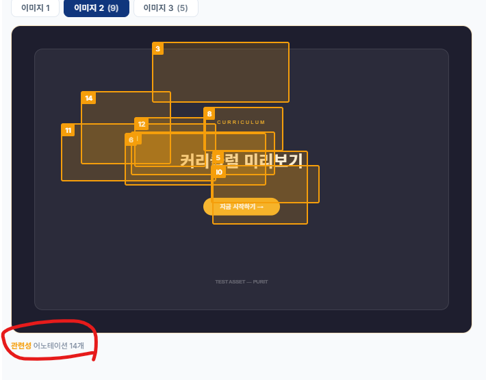

# 프로젝트 통제 원칙 (PURIT)
이 프로젝트의 모든 작업은 다음 핵심 문서를 유일한 진실의 원천(SSOT)으로 삼습니다.

## 상시 로드 문서 (매 대화 자동 로드)
작업 시 항상 이 파일들을 최우선으로 참고하십시오:
- @1_PRD.txt
- @2_Architecture.txt
- @3_Error_Log.txt

## 조건부 로드 문서 (자동 로드 금지 — 해당 조건에서만 Read 도구로 직접 읽을 것)

### 4_DBSchema.txt — DB 스키마 & RPC 함수 목록
✅ 다음 상황에서만 Read 도구로 직접 읽을 것:
   - 새 테이블·컬럼·인덱스·RLS 정책 추가/수정 전
   - 새 RPC 함수 작성 전
   - Supabase 쿼리 작성 시 컬럼명·FK 관계 확인이 필요할 때
   - 마이그레이션 파일(supabase/migrations/) 수정 시
❌ 단순 UI 변경, 라우트 추가, 기존 쿼리 복사·수정 등의 작업에서는 읽지 말 것

### 4_Backlog.txt — 미구현·재설계 예정 기능 목록
✅ 다음 상황에서만 Read 도구로 직접 읽을 것:
   - 미구현·재설계 예정 기능을 개발하기 전 (계획 확인)
   - "작전 종료" 시 새로 발견된 미구현 이슈나 재설계 계획이 있으면 추가
❌ 그 외 상황에서는 읽지 말 것

## 기능 개발 및 디버깅 규칙
- 코드를 수정하기 전, 반드시 상시 로드 문서(1·2·3)를 확인하여 기존 아키텍처와 충돌하지 않는지 검토하십시오.
- 코드를 수정할 때는 전체를 다시 출력하지 말고 변경된 부분만 반영하십시오.

## 3_Error_Log.txt 작성 규칙
- 이 파일에는 반복 실수 방지를 위한 원칙·패턴·주의사항만 기록합니다.
- 날짜별 작업 내역(N차, 수정 파일 목록 등 변경 이력)은 절대 기록하지 마십시오. 변경 이력은 git log로 확인합니다.
- "작전 종료" 트리거 시 3_Error_Log.txt에 추가할 내용: 새로 발견된 버그 패턴 또는 해결책만 D-xx 형식으로 추가.

### D-xx 기록 자격 기준 (엄격 적용)
  ✅ 기록 대상: 알지 못하면 반드시 빠지는 비직관적 함정, 같은 실수가 재발할 수 있는 버그 원인과 해결책
     예) RLS가 에러 없이 쿼리를 통째로 실패시킴 / React setState 비동기 한계 / 라이브러리 특유의 옵션 함정
  ❌ 기록 제외 (아래 항목은 절대 추가하지 말 것):
     - 기능 구현 방법·설계 결정 (→ 1_PRD.txt 또는 2_Architecture.txt에 기록)
     - 비즈니스 규칙·UI 워딩 규칙 (→ 1_PRD.txt에 기록)
     - 단순 코딩 실수 (변수 누락, URL 오기재 등 — 누구나 바로 알아채는 실수)
     - 기능 완성 내역·변경 이력 (→ git log로 확인)

## 문서 동기화 및 백업 트리거 (필수)
사용자가 채팅창에 "작전 종료" 라고 지시하면, 즉시 코딩을 멈추고 다음 단계를 엄격한 순서대로 자동 실행하십시오:
2. DB 스키마·RPC 함수 변경이 있었다면 `4_DBSchema.txt`도 함께 최신화하십시오.
3. 해결된 에러나 주의사항을 `3_Error_Log.txt`에 추가하십시오.
4. 문서 최신화가 끝나면, 터미널 명령어를 통해 `git add .`, `git commit -m "docs: 문서 자동 동기화"`, `git push origin main`을 순차적으로 실행하여 백업하십시오.
